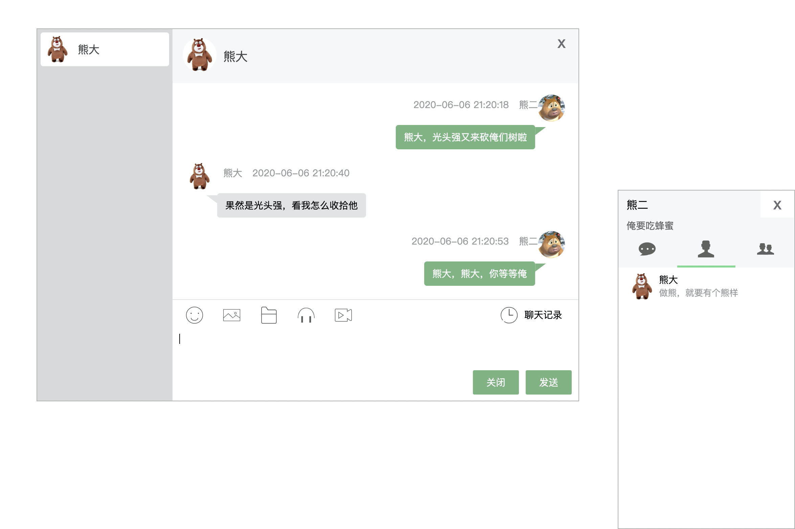

## Go语言开发基于websocket的聊天（IM）系统

本项目是由[gim](https://github.com/alberliu/gim) 项目fork而来，在此基础上进行了二次开发。目的在于开发一个基于websocket的聊天（IM）室，
并且支持**单用户多设备支持，离线消息同步**。在开发的过程中，砍掉了`gim`的gRPC、TCP服务端、Redis缓存等模块。同时，移除`go.mod`中大量的依赖，
仅保留了几个必须的包，其余均由纯go实现。

> 新增功能点

- 1.`A` 新增好友列表
- 2.`A` 新增web`模块，提供`RESTFul API`接口，可以用来注册设备、创建群组、添加用户、添加好友等。
- 3.`A` 新增聊天室Demo，在`example/web-im`目录中提供一个H5实现的聊天室（仅测试过：chrome浏览器）。

### 演示Demo

**[B站视频地址](https://www.bilibili.com/video/BV1uZ4y1H7yy)**



测试数据：

```shell
# 熊大
http://localhost:63342/go-IM/example/web-im/index.html?uid=1629770111088857088

# 熊二
http://localhost:63342/go-IM/example/web-im/index.html?uid=1629770216865009664

# 光头强
http://localhost:63342/go-IM/example/web-im/index.html?uid=1629769779311022080
```

### 开发

```sh
go mod download

# 默认运行在 127.0.0.1:8080
go run main.go
```

### License

The project is licensed under the MIT license.
