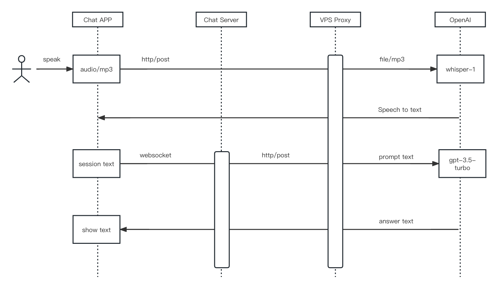
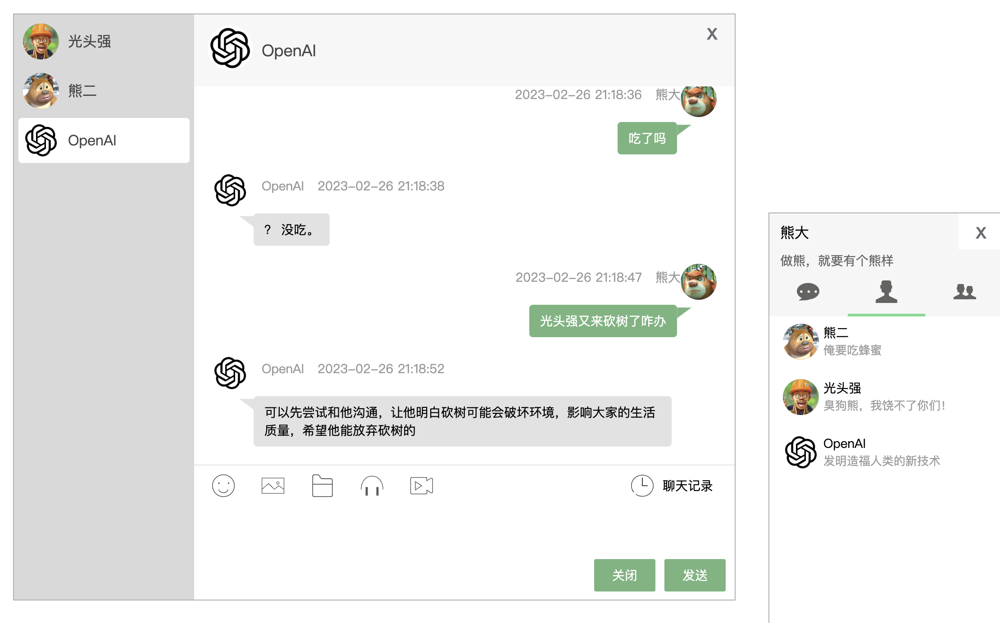

## ChatGPT 聊天机器人的 IM 系统

实时通讯 IM 系统接入 ChatGPT completion API 的绝佳实践案例，在会话中接入 OpenAI 最新发布的 Chat completion API，可以回答各种问题，像 ChatGPT 一样灵性。



**功能特性**

- 1.`A` 新增好友列表
- 2.`A` 新增 web 模块，提供 `RESTFul API` 接口，可以用来注册设备、创建群组、添加用户、添加好友等。
- 3.`A` 新增聊天室 Demo，在 `example/web-im` 目录中提供一个 H5 实现的聊天室（仅测试过：chrome 浏览器）。
- 4.`A` 使用嵌入数据库 Bolt 作为数据源，免去用户环境搭建，同时内置演示数据，方便体验
- 5.`A` 新增接入 OpenAI 云端 API 服务，实现类似 ChatGPT 的聊天机器人，可以回答各种问题
- 6.`A` 新增接入 OpenAI 最新发布的 Chat completion API，回答问题像 ChatGPT 一样灵性
- 7.`A` 新增接入 OpenAI 最新发布的 Whisper API 实现语音转文字

### 演示 Demo

**B站视频**：https://www.bilibili.com/video/BV1uZ4y1H7yy)



测试数据：

```shell
# 熊大
http://localhost:63342/go-IM/example/web-im/index.html?uid=1629770111088857088

# 熊二
http://localhost:63342/go-IM/example/web-im/index.html?uid=1629770216865009664

# 光头强
http://localhost:63342/go-IM/example/web-im/index.html?uid=1629769779311022080
```

### 开发

```sh
go mod download

# 默认运行在 127.0.0.1:8080
go run main.go
```

### License

The project is licensed under the MIT license.
